# MODULE 5 
## Performance Testing (using JMeter)
### /all-student-name 

*View Results Tree.*
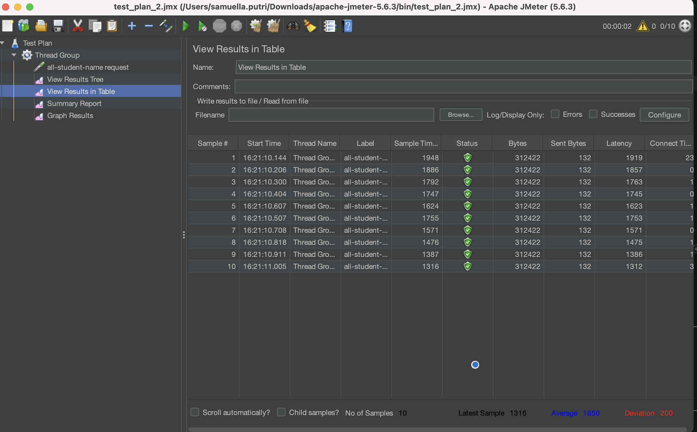
*View Results in Table.*
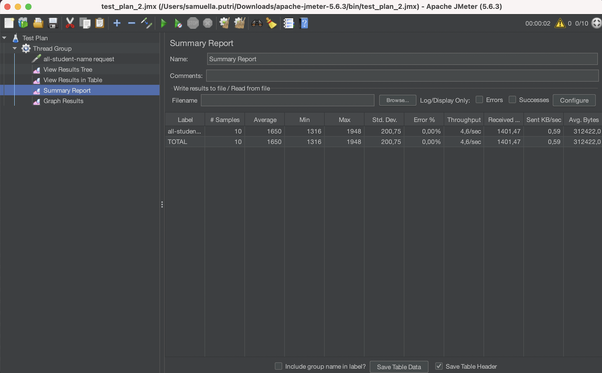
*Summary Report.*
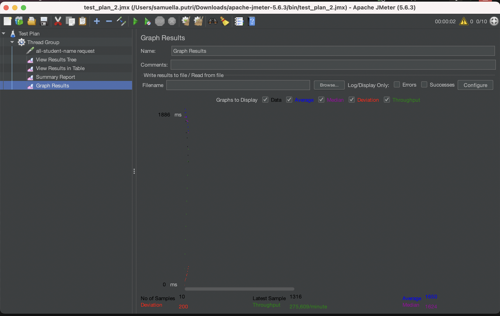
*Graph Results.*

### /highest-gpa
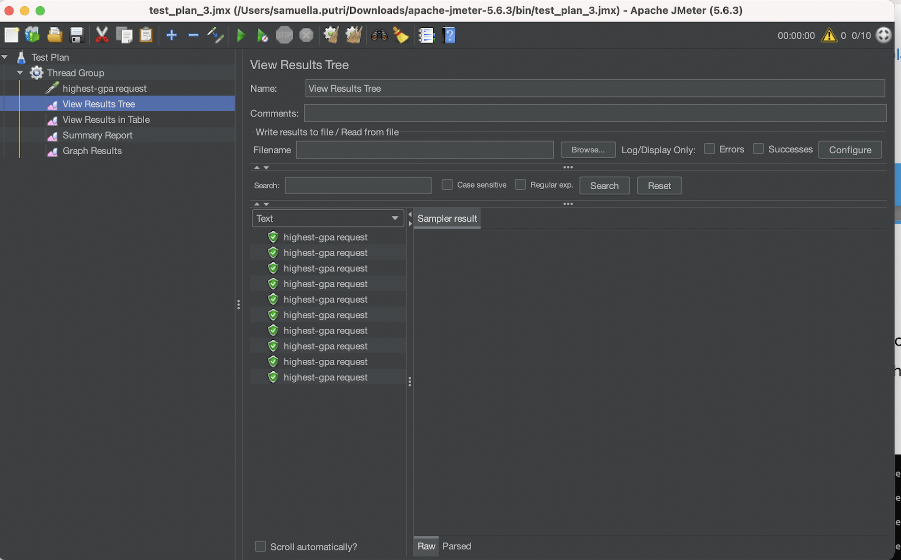
*View Results Tree.*
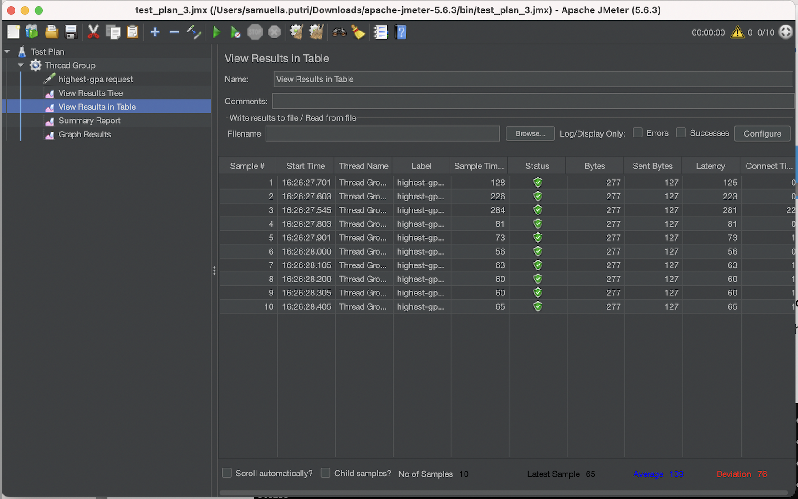
*View Results in Table.*
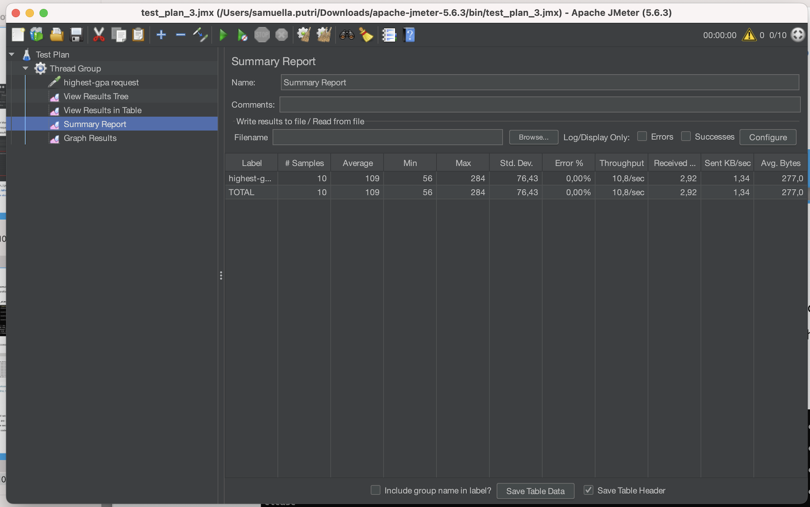
*Summary Report.*
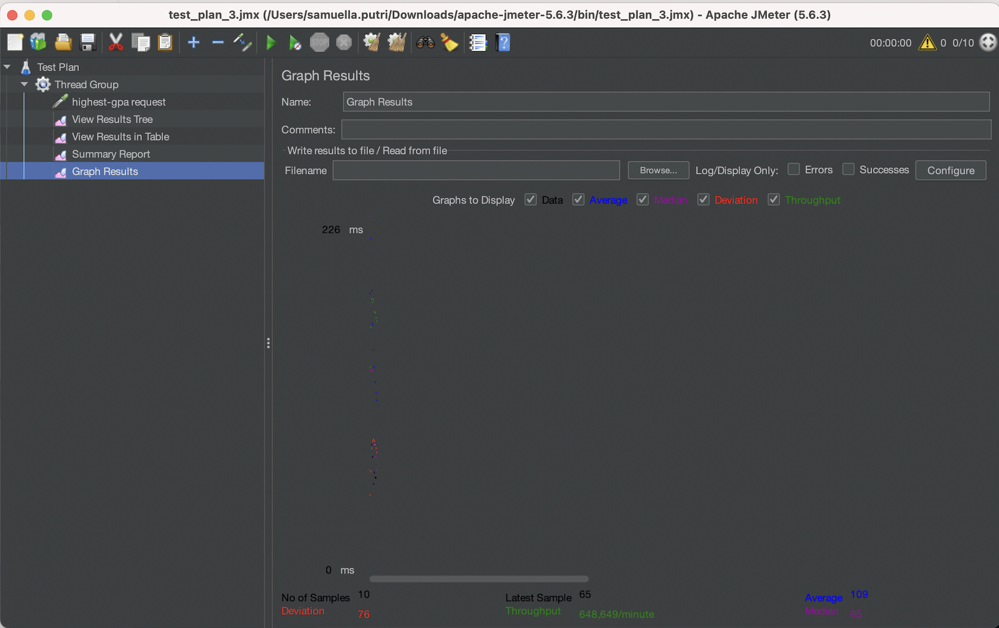
*Graph Results.*

### Command Line
#### /all-student-name
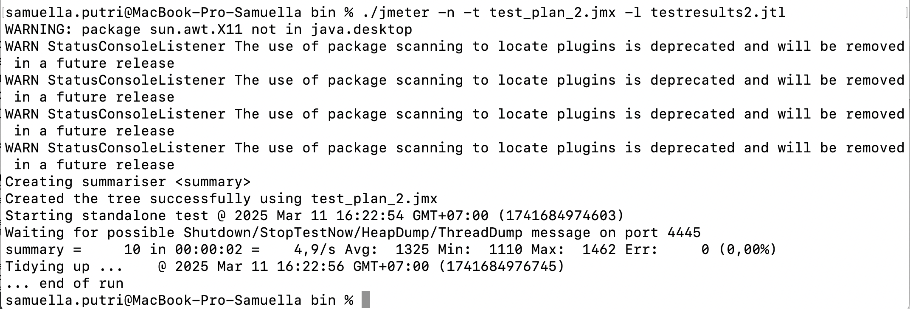
*Command Line.*
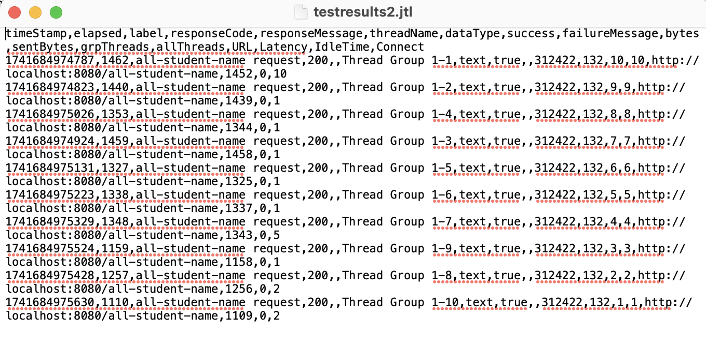
*Log File.*

#### /highest-gpa
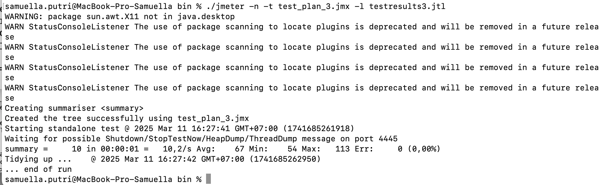
*Command Line.*
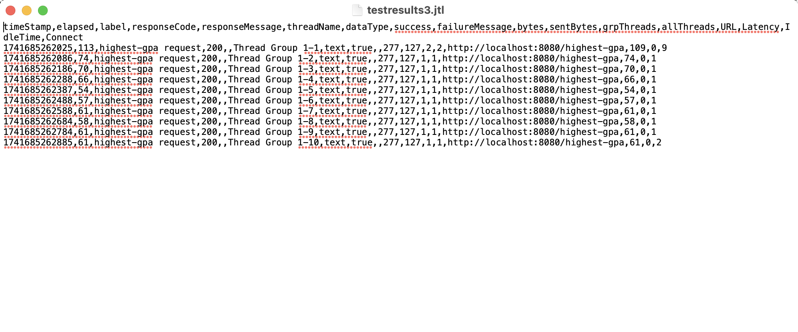
*Log File.*

## Profiling
### Optimization Results
#### /all-student-name 

*Before Optimization.*
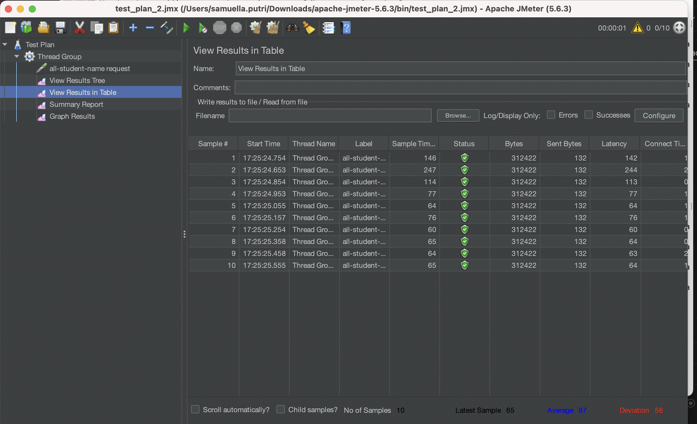
*After Optimization.*

#### /highest-gpa

*Before Optimization.*
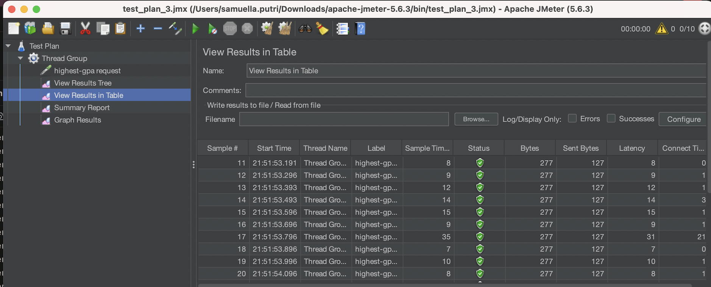
*After Optimization.*

### Explanation
Before optimization, the runtime for each thread request was significantly high, leading to long sample times for the /all-student-name and /highest-gpa endpoints.
To address this, I optimized key methods such as findStudentWithHighestGpa() and joinStudentNames() by reducing inefficient loops and utilizing database queries effectively.
After implementing these optimizations, the runtime for both endpoints dropped significantly, improving response times and overall performance.

## REFLECTION
#### What is the difference between the approach of performance testing with JMeter and profiling with IntelliJ Profiler in the context of optimizing application performance?
JMeter focuses on load testing and stress testing by simulating multiple users (threads) making requests to an application. It helps measure response times, throughput, and system scalability under load. On the other hand, IntelliJ Profiler provides a deeper analysis of internal application performance, memory consumption, and method execution time. It helps detect bottlenecks in specific methods within the code.
#### How does the profiling process help you in identifying and understanding the weak points in your application?
Profiling helps by providing detailed execution traces, showing which methods consume the most time, which database queries take too long and how different methods interact during execution. By analyzing these factors, profiling helps identify slow methods, redundant computations, and inefficient memory use, allowing for targeted optimizations.
#### Do you think IntelliJ Profiler is effective in assisting you to analyze and identify bottlenecks in your application code?
Yes, i feel like IntelliJ Profiler is effective because it provides real-time execution statistics of each method and it pinpoints which functions need optimization, instead of guessing where the problem is. By using it, I was able to optimize key methods like findStudentWithHighestGpa() and joinStudentNames() by eliminating inefficient loops and utilizing database queries. 
#### What are the main challenges you face when conducting performance testing and profiling, and how do you overcome these challenges?
I faced some challenges i faced when conducting performance testing and profiling. One of them are about interpreting profiling results because raw data from profilers can be overwhelming. Another one is inconsistencies in test results since different runs may yield slightly different performance due to background processes. 
#### What are the main benefits you gain from using IntelliJ Profiler for profiling your application code?
The benefits i gain from using IntelliJ Profiler for profiling my application code include getting detailed insight into execution time per method and having a real-time visualization.
#### How do you handle situations where the results from profiling with IntelliJ Profiler are not entirely consistent with findings from performance testing using JMeter?
One approach I did was doing a cross-checking for multiple runs by runningJMeter and Profiler tests multiple times to ensure results are stable. 
#### What strategies do you implement in optimizing application code after analyzing results from performance testing and profiling? How do you ensure the changes you make do not affect the application's functionality?
Some strategies I implemented are using database query optimization, avoiding redundant loops, and using efficient data structures. To ensure the changes do not affect the application's functionality, I ran the unit and integration tests to verify that the optimizations do not introduce any errors/bugs and I also benchmark the performance before and after changes by comparing JMeter results to measure improvements.

