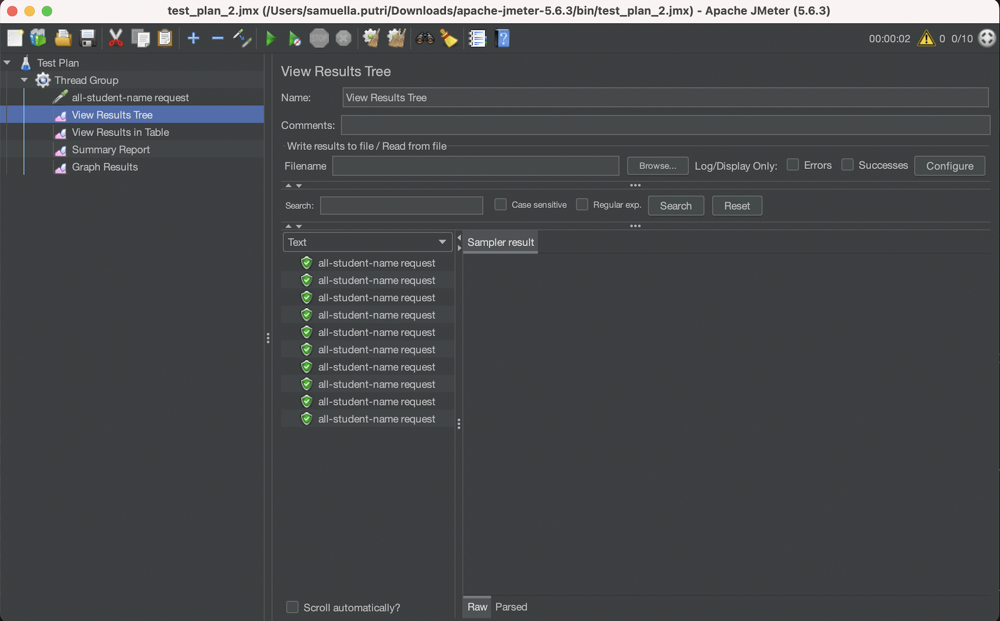

# MODULE 5 
## Performance Testing (using JMeter)
### /all-student-name 

*View Results Tree.*

*View Results in Table.*

*Summary Report.*

*Graph Results.*

### /highest-gpa

*View Results Tree.*

*View Results in Table.*

*Summary Report.*

*Graph Results.*

### Command Line
#### /all-student-name

*Command Line.*

*Log File.*

#### /highest-gpa

*Command Line.*

*Log File.*

## Profiling
### Optimization Results
#### /all-student-name 

*Before Optimization.*

*After Optimization.*

#### /highest-gpa

*Before Optimization.*

*After Optimization.*

### Explanation
Before optimization, the runtime for each thread request was significantly high, leading to long sample times for the /all-student-name and /highest-gpa endpoints.
To address this, I optimized key methods such as findStudentWithHighestGpa() and joinStudentNames() by reducing inefficient loops and utilizing database queries effectively.
After implementing these optimizations, the runtime for both endpoints dropped significantly, improving response times and overall performance.